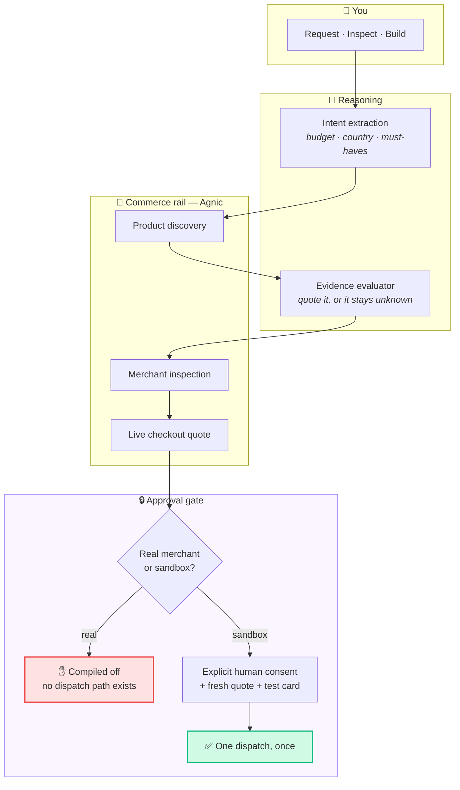
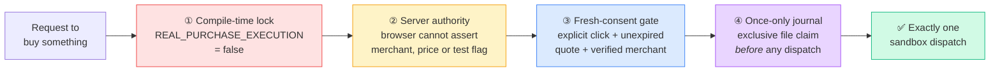
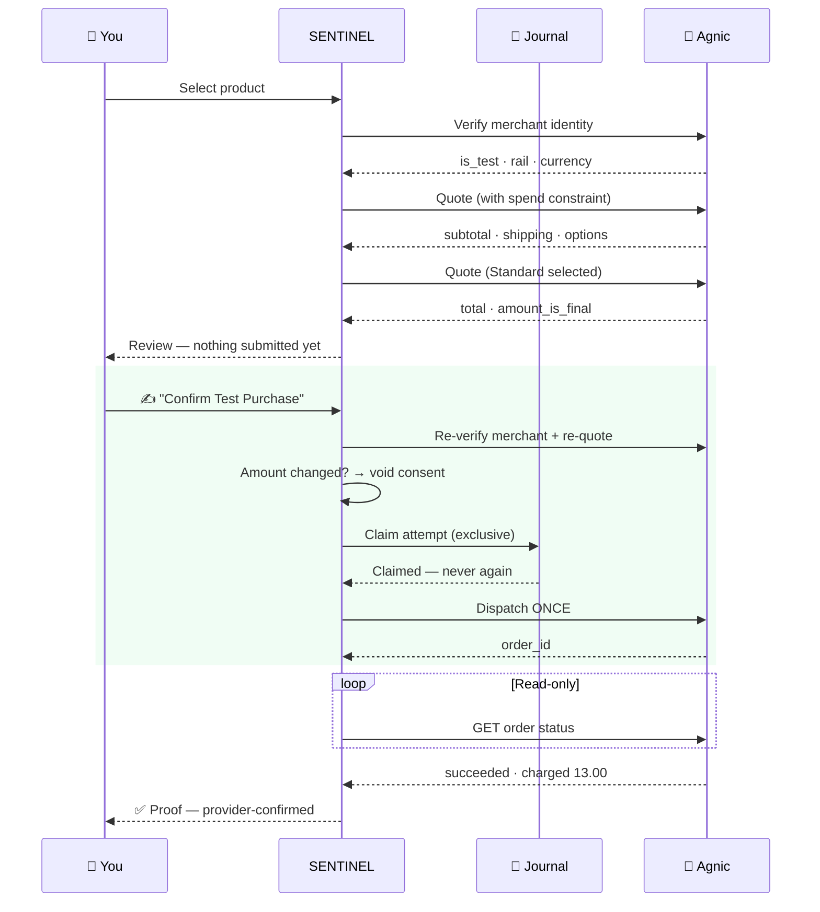
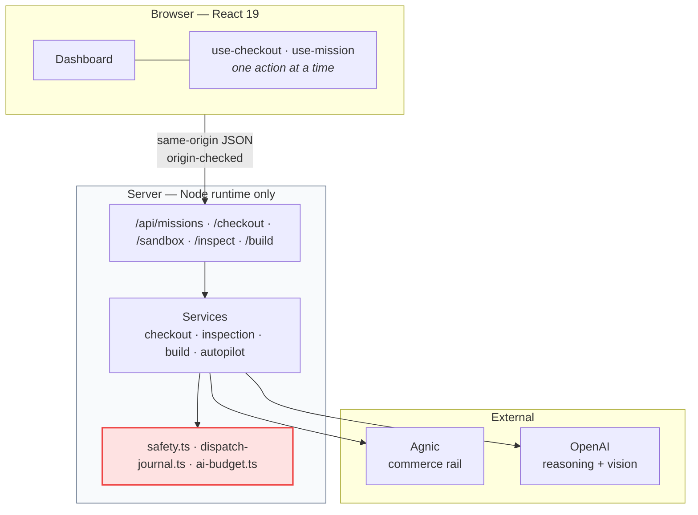

<div align="center">

# SENTINEL

### An autonomous commerce agent that earns the right to spend.

**[Live demo →](https://sentinel-taupe-two.vercel.app)**

[](https://sentinel-taupe-two.vercel.app)
[](#verification)
[](#the-safety-model)
[](https://nextjs.org)

*Describe a need, show a broken part, or sketch a project. SENTINEL finds real products at real
merchants, gets a real live quote — then stops and asks you.*

</div>

---

## The problem

Shopping agents demo well and ship badly. The gap is always the same: the moment an agent can
spend money, every hallucination becomes a chargeback. So most "agentic commerce" demos either
fake the checkout, or quietly hand an LLM a credit card.

SENTINEL takes the third path. **It runs the entire real pipeline — discovery, merchant
inspection, live quoting — against real stores, and refuses to spend.** Purchasing is proven
separately, end to end, against the payment provider's official sandbox.

The result is a system whose safety claim is testable rather than promised.

```
Real merchants  ──►  discover ──► inspect ──► live quote ──►  ✋ STOPS HERE
Agnic sandbox   ──►  discover ──► inspect ──► live quote ──►  ✅ real order, test card
```

---

## Proof it actually works

Not a mock. Not a screenshot. Real orders at a real Shopify store, placed through
[Agnic](https://agnic.ai)'s agentic-commerce API and verified by read-only lookup:

| Agnic order ID | Status | Charged | Approved max |
|---|---|---|---|
| `af_ord_mu9zosqku6pbjrwa` | ✅ `succeeded` | **CAD 13.00** | CAD 14.95 |
| `af_ord_mu9zmyrm8lyqm88u` | ✅ `succeeded` | **CAD 13.00** | CAD 14.95 |
| `af_ord_mu9stni0ls90uruo` | ✅ `succeeded` | **CAD 13.00** | CAD 14.95 |
| `af_ord_mu9enrtcm1rvph4a` | ⚠️ `worker_error` | *not charged* | CAD 14.95 |

Open the **Orders** tab in the live app — it reads this table straight from Agnic on every
load, not from browser storage.

> **The failed row is the point.** Checkout broke mid-flight, nothing was charged, and SENTINEL
> did not silently retry. It reported the failure and stopped. That is the behaviour the whole
> architecture exists to guarantee.

**SENTINEL never claims success on its own.** A checkout is shown as complete only after a
read-only lookup returns `succeeded` from the provider.

---

## How it works



### Three ways in

| Mode | You give it | It gives you |
|---|---|---|
| 🔍 **Request** | *"portable monitor under C$200, ships to Canada"* | Evidence-ranked shortlist with a live quote |
| 📷 **Inspect** | A photo of something broken | What it is, what failed, what replaces it |
| 🧱 **Build** | A reference photo of a setup | A bill of materials with compatibility checks |

Plus **Autopilot & Voice** — standing mandates in plain language *("keep these stocked weekly,
spend at most C$70")* — and **Orders**, the provider-verified transaction record.

---

## The safety model

Four independent layers. Each one alone would stop a runaway purchase.



**① Real purchasing is compiled off — not configured off.**

```ts
// src/lib/server/safety.ts
export function assertRealPurchasesEnabled(): never {
  if (process.env.SENTINEL_REAL_PURCHASES_ENABLED !== "true" || ...) {
    throw new PurchaseSafetyError();
  }
  throw new PurchaseSafetyError();   // ← throws even if every flag is set
}
```

Setting the environment variable changes nothing. There is no real-commerce dispatch code path
to reach.

**② The browser is never trusted.** Merchant identity, test status, prices and amounts are
re-fetched server-side and re-verified immediately before dispatch. Input schemas reject any
client attempt to assert them.

**③ Consent must be fresh.** Confirmation requires an unexpired quote, an unchanged amount, a
server-verified sandbox merchant, and a vaulted test card. Change the fulfillment option and the
consent is void.

**④ One dispatch, ever.** A durable journal claims an exclusive attempt marker *before* the
network call. An unknown outcome stays claimed — an ambiguous result is never retried, because
retrying an ambiguous charge is how people get charged twice.

### What is genuinely real

| Real | Simulated |
|---|---|
| Agnic product discovery, merchant metadata, live quotes | — |
| Real Shopify checkout pricing, shipping, tax | — |
| Sandbox orders with genuine provider order IDs | — |
| Multimodal reasoning over your photos | — |
| | Autopilot scheduling *(runtime-only state)* |
| | Real-money purchasing *(no code path)* |

---

## Checkout, step by step



Note the ordering: **the journal is claimed before the network call, not after.** If the process
dies mid-dispatch, the attempt stays claimed and can never be repeated.

---

## Architecture



Secrets are `server-only`. No credential, address, or card alias ever reaches the browser — the
API returns booleans like `testCardConfigured`, never values.

| Concern | Where it lives |
|---|---|
| Agnic discovery, quotes, dispatch | `src/lib/server/adapters/agnic*.ts` |
| Reasoning + multimodal analysis | `src/lib/server/adapters/openai.ts` |
| Checkout orchestration | `src/lib/server/services/checkout.ts` |
| Safety guards & once-only journal | `src/lib/server/safety.ts`, `dispatch-journal.ts` |
| Spend ledger (C$5 cap) | `src/lib/server/ai-budget.ts` |
| UI | `src/components/sentinel/` |

**Stack:** Next.js 16.3 (App Router) · React 19 · TypeScript (strict) · Tailwind 4 · Radix ·
Zod at every boundary · Vitest.

---

## Run it locally

```bash
npm install
cp .env.example .env.local     # then fill in the values below
npm run dev                    # http://127.0.0.1:3000
```

| Variable | Purpose |
|---|---|
| `AGNIC_API_KEY` | Agnic credential (`agnic_tok_…`) |
| `OPENAI_API_KEY` | Reasoning + vision |
| `SENTINEL_ALLOW_PAID_AI` | `true` to permit model calls (C$5 ledger cap) |
| `SENTINEL_SANDBOX_MERCHANT_ID` | `merchant_untitled_fidget_shop` |
| `SENTINEL_SANDBOX_CARD_ALIAS_ID` | Hosted vaulted **test** card alias only |
| `SENTINEL_SANDBOX_CARD_CONFIRMED` | `true` once verified as a test card |
| `SENTINEL_SANDBOX_SHIP_TO_JSON` | Gitignored CA/US test destination |

> ⚠️ Never put a card number, expiry or CVV in code, environment files or any input field.
> SENTINEL only ever handles an alias created by Agnic's hosted card page.

`npm run check:agnic` prints merchant metadata and setup booleans — no tokens, addresses or
aliases.

### Reproducing a sandbox purchase

1. Vault a test card at Agnic's hosted card page. **The vaulted security code lives about 50
   minutes** — dispatch inside that window or the provider returns a step-up instead of charging.
2. Open **Demo sandbox checkout → Load Official Test Store → Paw Print Charm**.
3. A Standard-shipping quote loads automatically. Nothing is submitted.
4. Click **Review & Confirm Test Purchase** and confirm.
5. Watch status poll until Agnic reports `succeeded`, then check the **Orders** tab.

Expect **CAD 13.00** — CAD 1.00 item + CAD 12.00 shipping — against a CAD 14.95 ceiling.

---

## Verification

```bash
npm run typecheck   # tsc --noEmit, strict
npm run lint        # eslint
npm test            # 510 tests across 36 files
npm run build       # production build
```

Tests cover the parts that matter: once-only dispatch under concurrency, consent expiry, budget
enforcement, merchant-identity rejection, secret redaction, and that an unknown dispatch outcome
is never retried.

---

## Known limits

Stated plainly, because a safety claim with hidden caveats is not a safety claim.

- **Deployment.** The dispatch journal and spend ledger use the host's writable temp directory
  on serverless. That enforces limits **per running instance**, not globally. A persistent Node
  host is required for durable guarantees.
- **Duplicate protection is local.** It binds to the browser owner, merchant and SKU. Clearing
  cookies or using another client is outside this guard — it is not provider-wide idempotency.
- **Autopilot** scheduling and policy state are runtime-only and clear on restart.
- **The C$5 AI cap** is conservative accounting with a safety buffer, not an exchange-rate quote,
  and it does not know account-wide usage.
- **The sandbox merchant reports `is_test=false`** by design — it is an ordinary Shopify shop
  with Shopify Payments in test mode, per Agnic's testing documentation. SENTINEL allows this one
  documented identity and only its support-confirmed C$1 variants.

---

<div align="center">

**Built with [Agnic](https://agnic.ai) + [OpenAI](https://openai.com) · Deployed on [Vercel](https://vercel.com)**

*Real discovery. Real quotes. Real restraint.*

</div>
